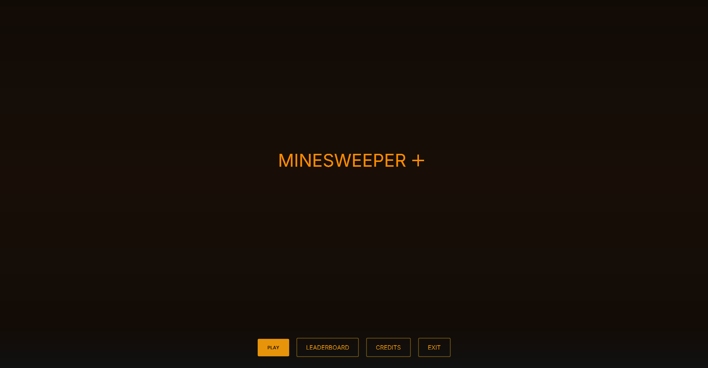
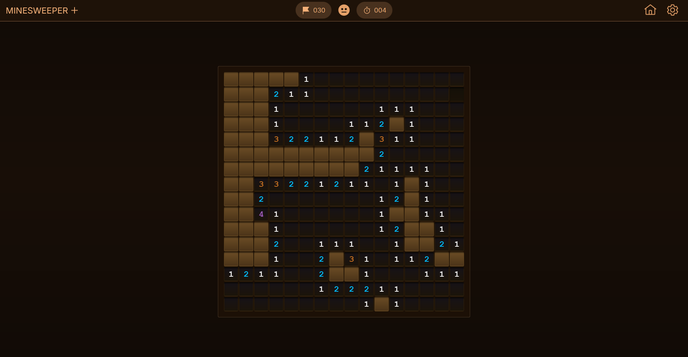
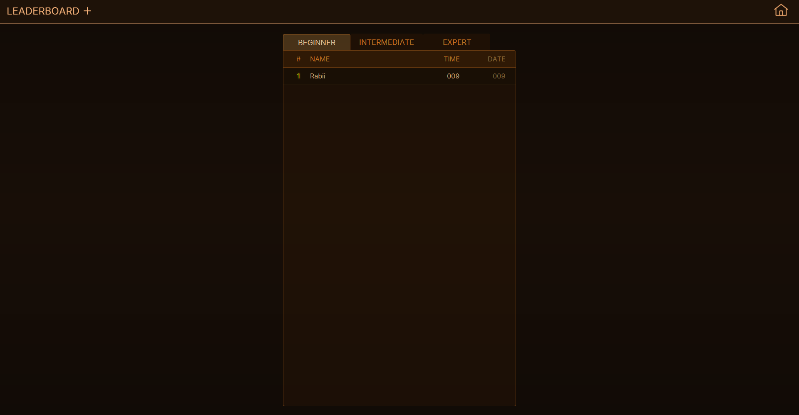

# 💣 Minesweeper

A fully-featured desktop Minesweeper game built with **Java 21** and **JavaFX**, featuring a clean component-based UI, three difficulty levels, and a persistent leaderboard backed by MySQL.

---

## Screenshots

### Main Menu

### Gameplay

### Leaderboard


---

## Features

- **Three difficulty levels** — Beginner, Intermediate, and Expert
- **Safe first click** — mines are placed after your first reveal, so you never lose immediately
- **Persistent leaderboard** — top scores saved to a MySQL database, queryable per difficulty
- **Component-based UI** — reusable JavaFX components for tiles, popups, top bars, and animations
- **Confetti on win** — because you deserve it 🎉
- **Elapsed timer** — tracks how fast you clear the board

---

## Architecture

The project follows an MVC-style structure:

```
src/main/java/com/rabiiyouness/minesweeper/
├── Main.java                  ← JavaFX entry point
├── controller/                ← Navigation & game lifecycle
│   ├── MainController.java    ← Central router, owns the Stage
│   ├── GameController.java    ← Game logic binding, timer, score save
│   ├── MenuController.java
│   ├── LeaderboardController.java
│   ├── OptionsController.java
│   └── CreditsController.java
├── model/                     ← Pure game logic, no UI
│   ├── Board.java             ← Mine placement, reveal, flood-fill, win/loss
│   ├── Tile.java
│   ├── Position.java
│   ├── Score.java
│   └── enums/                 ← Difficulty, GameState, TileState
├── view/                      ← JavaFX scene graph
│   ├── screens/               ← One class per screen (GameView, MenuView…)
│   └── components/            ← Reusable UI bricks (TileButton, PopupOverlay…)
├── dao/                       ← Database access
│   ├── ScoreDao.java
│   └── DbConnection.java
└── util/                      ← Helpers (TimeFormatter, PopupFactory)
```

**Key design decisions:**
- `MainController` is the single navigation hub — no screen renders without going through it
- `GameController` binds tile events to the `Board` model and saves scores asynchronously so the UI never freezes
- Every screen is assembled from small, independent components — changing a popup or the top bar doesn't touch anything else

---

## Getting Started

### Prerequisites

- Java 21
- Maven
- MySQL (optional — only needed for the leaderboard)

### Run the app

```bash
mvn javafx:run
```

### Build a JAR

```bash
mvn -DskipTests package
```

### Run tests

```bash
mvn test
```

---

## Database Setup

The leaderboard is optional. If you skip this, the game runs fine — scores just won't be saved.

**1. Create the table:**

```sql
CREATE TABLE scores (
  id                      BIGINT AUTO_INCREMENT PRIMARY KEY,
  name                    VARCHAR(255) NOT NULL,
  difficulty              VARCHAR(32)  NOT NULL,
  completion_time_seconds INT          NOT NULL,
  played_at               TIMESTAMP    NOT NULL
);
```

**2. Set your environment variables** (or create a `.env` file — see `.env.example`):

```
DB_URL=jdbc:mysql://localhost:3306/minesweeper
DB_USER=your_user
DB_PASSWORD=your_password
```

The app uses [dotenv-java](https://github.com/cdimascio/dotenv-java) to load these automatically.

---

## Tech Stack

| Layer | Technology |
|---|---|
| Language | Java 21 |
| UI | JavaFX |
| Build | Maven |
| Database | MySQL via JDBC |
| Env config | dotenv-java |

---

## Project Structure Notes

- **Mine placement is deferred** — `Board` waits for the first reveal before placing mines, guaranteeing the first click is always safe
- **Score saves run in a background `Task`** — the UI stays responsive even if the DB is slow
- **Debug helpers exist** (`W`/`E` keybinds for auto-flag/auto-reveal) — these are development conveniences and will be removed in a future cleanup

---

## License

See [LICENSE](./LICENSE) for details.